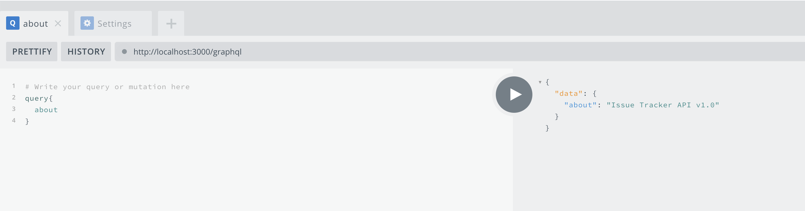
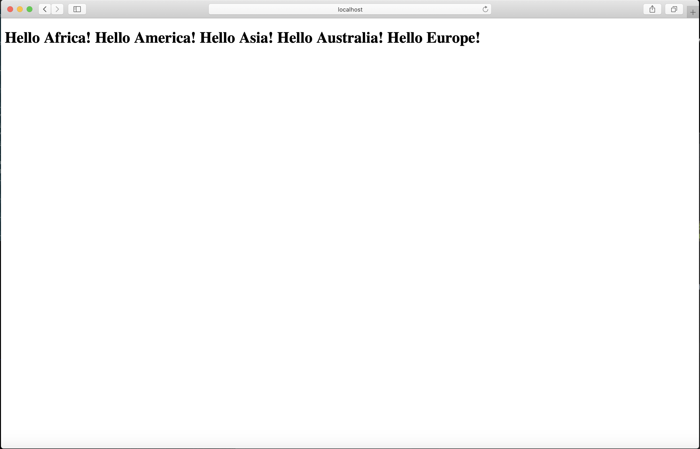

# ZiqiTang-Book

## Chapter 6

### Mongo NodeJS driver
* In this section, we want to get to know the mechanism of mongoDB and integrate it into our system.
* We're using nodeJS driver to run some simple mongoDB scripts to test the functionality.
* Firstly, we're using callback function to print the log if the error happenes.

* Secondly, we could instead using try/catch in the async function to test these mongo CRUD operations.

## Chapter 5

### The About API
* In this step, we use Apollo server and GraphAPI to set up the about API
* We define two fields in GraphQL for getting and setting the about message.
* We need to set up corresponding resolvers for the defined schema.
* Lastly, we'll launch the Apollo server in Express as the middleware.
* We could test our APIs on the URL where we run our server.

### GraphQL Schema File
* We put type definition into a separate schema file

### The List API
* We'll create a list GET API in this step.
* We define a new type issue and list all the fields' types inside it and put it into the Query scope.
* In the server code, we also need to add a resolver under Query for the new field.

### Integrate the List API
* Inside the loadData() method in the App.js, we could use asychronized call to get the data from DB.
* use POST request, and set the body to the query message.

### Custom Scalar Types
* We want to use scalar type for Date, since we could do some calculations and comparisons on the server side.
* Firstly, we define the scalar type instead of the normal type in the schema file.
* Secondly, we need to add a top-level resolver for all scalar types utilizing both serialization and parsing.

### The Create API
* We create a new API for adding the new issue in the app.
* We need to add a new field called IssueAdd in the schema file.
* Also, we need to serialize and parse the date String so we add parser in the GraphQLDate Type thus when we send out the request the date-related fields will be properly handled.
* After that, we need to integrate the create API to our app
* When we hit the button, we will call the IssueAdd mutation API to add the issue data to the server.
* In this way, the table will remain the added rows after refresh.
* Also, we should use query variables to prevent errors for the field input 

### Input Validation and Error Displays
* We could use dropdown box and enum fields to restrict the input
* We could add helper function to check if some inputs are invalid
* We could use alert pop up in JS to display the error in our App

## Chapter 4
   In this chapter, what we want to do is to add components which can respond to the users' input and events.
  In React, we could implement that using state.
### Inital State
* The state of a component is captured in this.state variable using the form of key-value pair in the component’s class.
* In the first step, we just create the inital state variable and store it in this.state variable in the constructor of IssueTable class.

### Async State Initialization
* Normally, the initialization state will require to be fetched via API call instead of static setup in the constructor.
* In this step, we use asynchronized call in the componentDidMount() method to set up the state after the DOM is represented.
* We use the setState() callback function inside the asynchronized call to set the initial state. 
* Setting the state outside the constructor is to make sure that the state will be set after all the components are ready to be rendered(DOM is ready).

### Updating State
* In this step, we need to append the content of the components
* To do this, we need make a copy of this.state first and use setState() to set up the appended array.

### Lifting State Up
* In this step, we need to refactor the code to separate the whole processes into their own components.
* We'll create the IssueList class and make it as the father component and make the IssueAdd and IssueTable as its children component.
* We put load data and add row method into the IssueList class.
* We pass the this.state and this.createIssue method down to the children class as props and the children class will render using these props.
* We need to bind the createIssue method to IssueList component since we need to call the function with this refering to IssueList class.
* The results remain the same.

### Event Handling
* We will and a form on the bottom of the table and set the onSubmit event handler for the button to add the content we input into the IssueTable.
* We will render using the document form and pass the text we input as props of the handling method.
* Inside the handleSubmit method, we need to handle the event and use createIssue method to add rows to the table.
* The bind for handleSubmit method is needed since the original object is the window.

## Chapter 3
### Issue Tracker
* add classes representing components of issue trackers

### React Classes
* the objective is to convert the single-line JSX into a simple React component instantiated
  from a React class, so that we can later use the full power of the first class React components.

### Composing Components
* the UI can be split into smaller independent pieces so that each piece can be coded and reasoned in isolation, making it easier to build and understand a complex UI.
* A component takes inputs (called properties) and its output is the rendered UI of the component.

### Passing Data

* Using properties: It should be possible to pass different input data from a parent component to a child component and make it render differently on different instances.

* Using children: There is another way to pass data to other components, using the contents of the HTML-like node of the component. In the child component, this can be accessed using a special field of this.props called this. props.children.
              
              
              
              ​    
### Dynamic Composition
* I replace our hard-coded set of IssueRow components with a programmatically generated set of components from an 
array of issues.

### Summary 
  It was fun to write Web app using React. The component-based framework is
  very easy to use and we are able to manage the web UI gracefully using component classes. 

## Chapter 2
### Server-less Hello World
* simple piece of code in a single HTML file that uses React to
  display a simple page on the browser
* use React to create element and render
* can see the Hello World page through the broswer

### JSX
* JSX stands for JavaScript XML
* Since browsers’ JavaScript engines don’t understand JSX，we have to transform JSX into regular JavaScript
based React.createElement() calls using Babel.

### Project setup
* nvm: Node Version Manager, that tool makes installation and switching
        between multiple versions of Node.js easy.
* Node.js: Node.js is JavaScript outside of a browser. The creators of Node.js just took Chrome’s V8
           JavaScript engine and made it run independently as a JavaScript runtime.
* Express: Express is a framework that simplifies the task of writing the server code.
           The Express framework lets you define routes, specifications of what to do when an HTTP request matching a 
           certain pattern arrives.        

### Separate Script File
* in order to make the code efficient.
* We move the transformation to the build stage in our development, so that
  we can deploy a ready-to-use distribution of the application.
  
### JSX Transform
* We create a new directory to keep all the JSX files, which will be transformed into plain JavaScript and
  into the public folder.
  
### Older Broswer Support
* use Babel to transform newer version of JavaScript to the older version.
* add an array for different continents.
* The screenshots after running are as below (for Chrome and Safari).

### Automated
* add customized commands in package.json to allow customized commands to be run

### Summary
  It was fun to get familiar with the tools like Express and Node.JS. The MERN stack is very
  convenient to use and easy to understand.