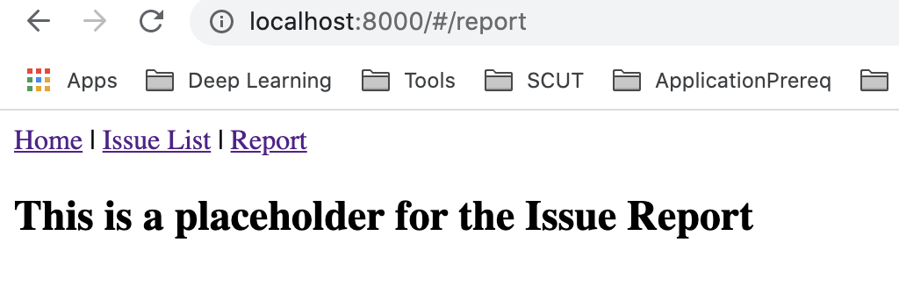
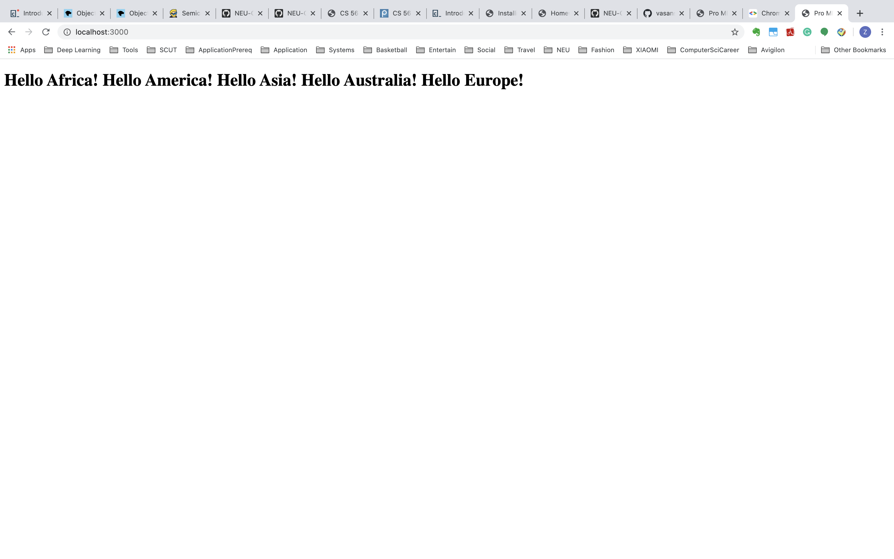

# ZiqiTang-Book

## Chapter 11

### Bootstrap
* We use bootstrap framework to change the style of our app and make it fit for mobile screen.

* We change the style of the button using bootstrap packages.
* We use the icon for both "close" and "delete" button, when we hover over the button, the top will be displayed.

### Navigation Bar

### Panels
* We will and a panel for the filter area.
* We use the grid to display the gap.
* Also, we set the type of cursor to indicate the header is clickable.

### Tables
* In this step, we convert the table to Bootstrap table which fits better with both screens.
* "Select" button is turned into the clickable rows.

### Forms
* We use Bootstrap form to justify the filter panel.

* We will also change the edit form to horizontal form.

### Validation
* We add a status indicating the validity of the user input.
* Also, we will show the alert message using Bootstrap.

### Toast
* Instead of using the alert, we convert them using the Toast message which can be customized to disappear after several seconds.
* We'll apply the toast message to both creating, editing and deleting issues.

### Modal
* At last, we will convert the create issue to the pop up window and redirecting us to the edit page.

## Chapter 10

### Controlled Component
* We get the status of the current filter from the parent component's props and display in the dropdown box.

* We then add two buttons including "Apply" and "Reset".
* Now, we will record the current state and change status, the filter won't be changed until the apply button is hit.
* We are also allowing the user to reset to the current status before applying it when selecting the wrong filter.

### Typed Input
* We add the effort value fields in query sentence and use it when applying the filter.

### Edit Form
* We add the edit form page when clicking on the edit button in each line of the issue.
* Also, the prev and next button allow navigating to prev/next page according to ID.

### Specialized Input
* We'll add special class for different inputs and handle some invalid input.
 

### Update the issue using API
* Firstly, we will add a new mutation in schema to allow updating the issue.
* Then, we'll rewrite the handleSubmit() method to actually call API and store the updated data into the datebase.
* All the wrong input should be handled because of the using of specialized input type.

* After that, we will add close button on each issue and set the status to "Closed" by clicking on the button.

* Then we also add delete function.

## Chapter 9

### Simple Routing
* In this step, we are using the React HashRouter to deal with the page routings.
* We add nav bar at the top of the index page.
* We redirect the home page to the IssueList page.
* We will make the page show "Page not found" when the routing is wrong.

### Route Parameters
* In this step, we are using hyperlink in IssueTable to route to the specific links using props

### Query Parameters
* In this step, we add another nav bar in order to allow routing to issues with different statuses.
* Add another componentDidUpdate() function to check if the search is changed.

### Links
* In this step, we change the a href elements to React Links. 

### Programmatic Navigation
* We add a dropdown box for filtered issues page routing.

### Nested Routing
* In this step, we will add the IssueDetail components and use dynamic routing to let it link to another section of the page.
* We'll firstly change the schema (add the description field).
* In each issue, we will add get issue to fetch data for each issue.
* Inside the IssueDetail component, the loadData() method will be called when the component is firstly mounted or its ID has been changed.

## Chapter 8

### Back-end Modules
* In order to separate different functionalities and modules for backend codes, we will refactor the backend code.
* The original Server.js file is separated into 5 parts including about.js, api_handler.js, db.js, graphql_date.js and server.js.

## Front-end Modules
* After refactoring the back-end modules, we split the ui code into two parts. we separate the fetching from mongoDb part into another file to decouple our app.

## Transform and Bundle
* We are using the Webpack package to watch the app right now.
* Then we separate the entire App.jsx to different classes in order to decouple.

## Library Module
* In the previous step, we're getting every three-party libraries from CDN, but this costs us more time to load package and more memory.
* Alternatively, we use Webpack to include these packages.
* Now, we are fetching data from the verndor bundle of UI server. If we change some of the Jsx, the response code 304 will appear.

## Hot Module Replacement
* In this step, we want to apply HMR to avoid tedious refreshing and allow instant rerendering if any changes have been made.

* After using the module.hot.accept() the changes should be accepte

## Chapter 7

### UI server
* In order to make our system more scalable for larger traffic, we want to separate the server into two parts -- ui and api.
* When the scale of the customers increases, the api server may need load balancer, so I should be a good practice to separate the api server.
* After the separation, the ui server will contain only the static middleware and the api server is only responsible for handling APIs.
* Upon deployment, the ui server will display the static page and get data from mongoDB, then we the user made the new requests the api will handle them.

### Multiple environments
* We elminate the hard code variables and set them in separate variables in separate env file.

### Proxy-Based Architecture
* In order to prevent malicious websites from gaining unauthorized access to the
  application, we adopt proxy architechture in this step.

### Eslint
* We are using the Eslint to restrict the code format according to Airbnb.

* Also, change the style for the ui code.

## Chapter 6

### Mongo NodeJS driver
* In this section, we want to get to know the mechanism of mongoDB and integrate it into our system.
* We're using nodeJS driver to run some simple mongoDB scripts to test the functionality.
* Firstly, we're using callback function to print the log if the error happenes.

* Secondly, we could instead using try/catch in the async function to test these mongo CRUD operations.

* After that, we can create a script to initialize the schema of the Mongo database.

### Reading and writing Data from MongoDB
* In the next step, we integrate the code into the server code and make it read from the MongoDB.
* The result will look the same, but we actually reading data from mongoDB, I test it by adding a record in mongo.

* Also, we'll create another counter collections to keep track of the id number for each record.
* In this way, we could be able to find a new id and give it to the new record.

## Chapter 5

### The About API
* In this step, we use Apollo server and GraphAPI to set up the about API
* We define two fields in GraphQL for getting and setting the about message.
* We need to set up corresponding resolvers for the defined schema.
* Lastly, we'll launch the Apollo server in Express as the middleware.
* We could test our APIs on the URL where we run our server.

### GraphQL Schema File
* We put type definition into a separate schema file

### The List API
* We'll create a list GET API in this step.
* We define a new type issue and list all the fields' types inside it and put it into the Query scope.
* In the server code, we also need to add a resolver under Query for the new field.

### Integrate the List API
* Inside the loadData() method in the App.js, we could use asychronized call to get the data from DB.
* use POST request, and set the body to the query message.

### Custom Scalar Types
* We want to use scalar type for Date, since we could do some calculations and comparisons on the server side.
* Firstly, we define the scalar type instead of the normal type in the schema file.
* Secondly, we need to add a top-level resolver for all scalar types utilizing both serialization and parsing.

### The Create API
* We create a new API for adding the new issue in the app.
* We need to add a new field called IssueAdd in the schema file.
* Also, we need to serialize and parse the date String so we add parser in the GraphQLDate Type thus when we send out the request the date-related fields will be properly handled.
* After that, we need to integrate the create API to our app
* When we hit the button, we will call the IssueAdd mutation API to add the issue data to the server.
* In this way, the table will remain the added rows after refresh.
* Also, we should use query variables to prevent errors for the field input 

### Input Validation and Error Displays
* We could use dropdown box and enum fields to restrict the input
* We could add helper function to check if some inputs are invalid
* We could use alert pop up in JS to display the error in our App

## Chapter 4
   In this chapter, what we want to do is to add components which can respond to the users' input and events.
  In React, we could implement that using state.
### Inital State
* The state of a component is captured in this.state variable using the form of key-value pair in the component’s class.
* In the first step, we just create the inital state variable and store it in this.state variable in the constructor of IssueTable class.

### Async State Initialization
* Normally, the initialization state will require to be fetched via API call instead of static setup in the constructor.
* In this step, we use asynchronized call in the componentDidMount() method to set up the state after the DOM is represented.
* We use the setState() callback function inside the asynchronized call to set the initial state. 
* Setting the state outside the constructor is to make sure that the state will be set after all the components are ready to be rendered(DOM is ready).

### Updating State
* In this step, we need to append the content of the components
* To do this, we need make a copy of this.state first and use setState() to set up the appended array.

### Lifting State Up
* In this step, we need to refactor the code to separate the whole processes into their own components.
* We'll create the IssueList class and make it as the father component and make the IssueAdd and IssueTable as its children component.
* We put load data and add row method into the IssueList class.
* We pass the this.state and this.createIssue method down to the children class as props and the children class will render using these props.
* We need to bind the createIssue method to IssueList component since we need to call the function with this refering to IssueList class.
* The results remain the same.

### Event Handling
* We will and a form on the bottom of the table and set the onSubmit event handler for the button to add the content we input into the IssueTable.
* We will render using the document form and pass the text we input as props of the handling method.
* Inside the handleSubmit method, we need to handle the event and use createIssue method to add rows to the table.
* The bind for handleSubmit method is needed since the original object is the window.

## Chapter 3
### Issue Tracker
* add classes representing components of issue trackers

### React Classes
* the objective is to convert the single-line JSX into a simple React component instantiated
  from a React class, so that we can later use the full power of the first class React components.

### Composing Components
* the UI can be split into smaller independent pieces so that each piece can be coded and reasoned in isolation, making it easier to build and understand a complex UI.
* A component takes inputs (called properties) and its output is the rendered UI of the component.

### Passing Data

* Using properties: It should be possible to pass different input data from a parent component to a child component and make it render differently on different instances.

* Using children: There is another way to pass data to other components, using the contents of the HTML-like node of the component. In the child component, this can be accessed using a special field of this.props called this. props.children.
              
              
              
              ​    
### Dynamic Composition
* I replace our hard-coded set of IssueRow components with a programmatically generated set of components from an 
array of issues.

### Summary 
  It was fun to write Web app using React. The component-based framework is
  very easy to use and we are able to manage the web UI gracefully using component classes. 

## Chapter 2
### Server-less Hello World
* simple piece of code in a single HTML file that uses React to
  display a simple page on the browser
* use React to create element and render
* can see the Hello World page through the broswer

### JSX
* JSX stands for JavaScript XML
* Since browsers’ JavaScript engines don’t understand JSX，we have to transform JSX into regular JavaScript
based React.createElement() calls using Babel.

### Project setup
* nvm: Node Version Manager, that tool makes installation and switching
        between multiple versions of Node.js easy.
* Node.js: Node.js is JavaScript outside of a browser. The creators of Node.js just took Chrome’s V8
           JavaScript engine and made it run independently as a JavaScript runtime.
* Express: Express is a framework that simplifies the task of writing the server code.
           The Express framework lets you define routes, specifications of what to do when an HTTP request matching a 
           certain pattern arrives.        

### Separate Script File
* in order to make the code efficient.
* We move the transformation to the build stage in our development, so that
  we can deploy a ready-to-use distribution of the application.
  
### JSX Transform
* We create a new directory to keep all the JSX files, which will be transformed into plain JavaScript and
  into the public folder.
  
### Older Broswer Support
* use Babel to transform newer version of JavaScript to the older version.
* add an array for different continents.
* The screenshots after running are as below (for Chrome and Safari).

### Automated
* add customized commands in package.json to allow customized commands to be run

### Summary
  It was fun to get familiar with the tools like Express and Node.JS. The MERN stack is very
  convenient to use and easy to understand.